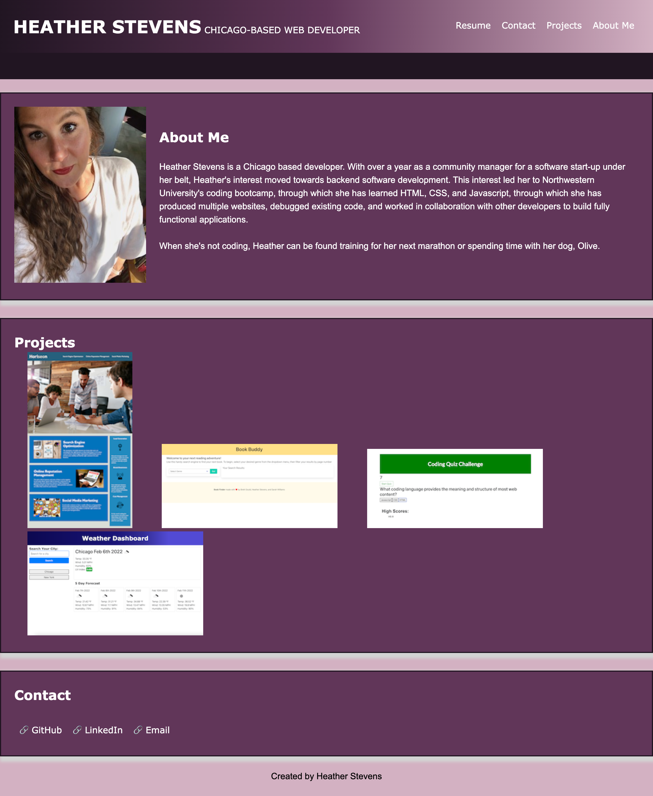

# Homework Two - Developer Portfolio

## Description

This portfolio was built using HTML and two CSS pages. One of those CSS pages is a general reset to create consistency across all browsers. The CSS page provides the styling for the HTML content.

Upon clicking the portfolio link, a user will be taken to my developer portfolio. My name and photo are featured prominently for ease of identification.

To the right of my name is the responsive navigation menu. This navigation menu allows the user to easily jump to any section of the website with one click. When the user clicks "Resume" they will be taken to a PDF of my developer resume. All other navigation elements will jump to an aptly named section on the webpage.

When a user click on the section entitled "Projects", they will be taken to a photo of four recently designed websites and applications. Upon hover, the picture gets a bit larger. Upon clicking on the image, the website or application will open in a new tab.

When the user resizes their browser window, the site is responsive and all the elements remain active. The elements on the webpage will adapt to the user's viewport.

## Screenshot

## Links to Application

- Here is a link to the repository: https://github.com/heatherveva/hw2.git
- Here is the page: https://heatherveva.github.io/hw2/
